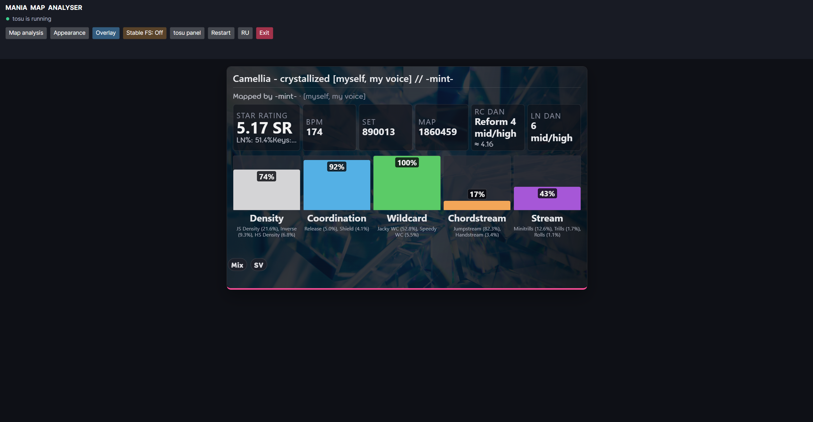
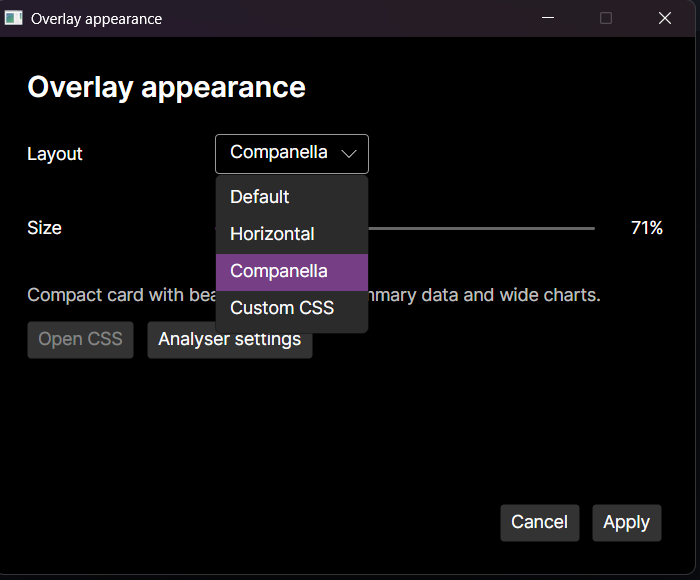

# Mania Map Analyzer Overlay


**Mania Map Analyzer Overlay** is a lightweight Avalonia desktop launcher for osu!mania. It starts and supervises [tosu](https://github.com/tosuapp/tosu), displays live beatmap analysis, and provides a customizable overlay without requiring the user to start a console script.

## Features

- Automatic tosu and [ManiaMapAnalyser](https://github.com/LeoBlackMT/osumania_map_analyser) setup, compatibility checks, hash verification, and lifecycle management.
- Works with osu!stable and osu!lazer; lazer compatibility offsets are checked during setup.
- Live SR, BPM, Set/Map IDs, DAN/Reform estimate, numeric difficulty, LN%, key count, pattern bars, Etterna skills, and difficulty graphs.
- Lightweight transparent overlay for windowed or borderless osu!, with automatic hiding while a map is being played.
- Default, Horizontal, Companella, and Custom CSS layouts with live preview in the launcher.
- Resizable overlay with DPI-aware rendering; resize by dragging an edge/corner or with `Ctrl` + mouse wheel.
- Optional tosu In-Game Overlay integration for osu!stable exclusive fullscreen on Windows.
- Startup update checks for the launcher and bundled analysis components; settings and custom CSS are preserved.
- English and Russian UI; choose a language from the selector. Language names and translations are loaded from `Assets/localization/manifest.json` and the referenced JSON files.

## Installation and first launch

Download the application package for your platform from [GitHub Releases](https://github.com/rol1t/mania-map-analyzer-overlay/releases), then extract it to a folder.

Windows:

1. Open the extracted folder.
2. Run **`Mania Map Analyzer Overlay.exe`**.

Linux (experimental):

1. Extract the `.tar.gz` package.
2. Run **`./Mania Map Analyzer Overlay`** from the extracted folder.

The application is the only user-facing entry point. Do not start `tosu` separately. On first launch, the GUI downloads the compatible tosu and ManiaMapAnalyser components, verifies their SHA-256 hashes, and starts tosu automatically. A network connection is required for this preparation step.

The launcher owns the tosu process and stops it when the launcher exits. If preparation fails, use **Restart** to retry it from the GUI.

On later launches, the launcher checks for newer application and component releases and offers the update from the GUI.

## Errors and logs

Errors are shown in the launcher and written with their operation and full stack trace to `application.log` in the per-user data directory (`%LOCALAPPDATA%\ManiaMapAnalyzerOverlay` on Windows, `$XDG_DATA_HOME/ManiaMapAnalyzerOverlay` or `~/.local/share/ManiaMapAnalyzerOverlay` on Linux). The standalone updater uses the same log and shows a Windows error dialog when an update fails. The launcher also protects the native overlay window-procedure boundary so an interaction failure is logged instead of terminating the process.

## Overlay controls

Use **Overlay** for windowed or borderless osu!. Use **Stable FS** only when osu!stable is running in exclusive fullscreen.

| Action | Control |
|---|---|
| Toggle click-through/input | `Ctrl+Shift+F9` |
| Leave overlay mode | `Ctrl+Shift+F10` |
| Move the widget | Drag the center while osu! is inactive and input is enabled |
| Resize the widget | Drag an edge/corner while osu! is inactive, or hold `Ctrl` and use the mouse wheel |

When osu! is the active window, overlay interaction is disabled so an accidental click cannot focus the widget or minimize the game. Disable the overlay when it is not needed to keep resource use low.

For osu!stable exclusive fullscreen, enable **Stable FS**, confirm the tosu restart, and use tosu's in-game editor (`Ctrl+Shift+Space`) to position the official in-game overlay. The launcher applies the selected layout and scale to that overlay.

## Appearance and CSS

Open **Appearance** to choose `Default`, `Horizontal`, `Companella`, or `Custom CSS`, then adjust the scale. The launcher previews the selected style immediately and applies it to the desktop overlay.

Overlay visibility is configured per preset in `manifest.json`. Set
`visibilityPolicy` to `always`, `outside-play`, `during-play`, `paused-only`,
or `never`. The shipped presets use `always` for Default and Horizontal and
`outside-play` for Companella. User presets can override this value without
changing application code.

To add or edit a language, add its JSON file and manifest entry under `Assets/localization`. UI code uses only localization keys, so changing a translation does not require recompiling the application.

For custom styling, open `overlay-custom.css` from the Appearance window. The editable copy is kept in the per-user application data directory and survives updates. Copy-ready examples are available in:

- [`docs/css/compact-companella-inspired.css`](docs/css/compact-companella-inspired.css) — compact wide card with cover-art tint and analysis bars.
- [`docs/css/minimal-glass.css`](docs/css/minimal-glass.css) — minimal glass-style colors, borders, and typography.

CSS can restyle and rearrange existing analyser elements; it cannot add a new live data source. The built-in Companella preset supplies its additional summary cards directly. Useful selectors include `.card.main-card`, `.star-block`, `.cluster-item`, `.ett-skill-item`, `.body-graph-wrap`, and `.mode-tag`.

## Creating user presets

Presets are ordinary resource folders. A preset is not compiled into the application: the launcher discovers its `manifest.json`, reads the referenced HTML and CSS files, and uses the same package for the Appearance preview and the in-game overlay. This makes a preset portable, reviewable, and editable with any text editor.

The **Custom CSS** option is a separate convenience path: it edits the global per-user `overlay-custom.css` file. A manifest-backed user preset is a self-contained package with its own name, template, stylesheet, and visibility policy. Use a user preset when you want to share a complete layout rather than only restyle the currently selected layout.

### 1. Create the preset folder

Create one folder per preset in the per-user data directory:

| Platform | User preset directory |
|---|---|
| Windows | `%LOCALAPPDATA%\ManiaMapAnalyzerOverlay\presets` |
| Linux | `$XDG_DATA_HOME/ManiaMapAnalyzerOverlay/presets`, or `~/.local/share/ManiaMapAnalyzerOverlay/presets` when `XDG_DATA_HOME` is not set |
| macOS (not currently shipped) | `~/Library/Application Support/ManiaMapAnalyzerOverlay/presets` |

For example, a Windows preset named `my-preset` has this layout:

```text
%LOCALAPPDATA%\ManiaMapAnalyzerOverlay\presets\my-preset\
  manifest.json
  template.html
  style.css
```

The folder name is only an organizational convenience. The `id` in the manifest is the stable identity shown to the application. Keep it unique and use lowercase letters, numbers, and hyphens. A user preset with the same `id` as a shipped preset intentionally overrides that shipped preset, so use a new id unless overriding is what you want.

The launcher reads built-in resources first and user resources afterwards. A malformed user preset is not silently accepted: the error and stack trace are written to `application.log`; if no valid resources are available, the Appearance window shows its missing-resources state instead of pretending that the preset loaded.

### 2. Add `manifest.json`

This is the smallest useful manifest:

```json
{
  "id": "my-preset",
  "name": "My Preset",
  "description": "A compact custom layout.",
  "template": "template.html",
  "stylesheet": "style.css",
  "visibilityPolicy": "always"
}
```

The JSON reader accepts normal JSON plus comments and trailing commas. Paths are relative to the preset folder. Absolute paths and `..` path escapes are not valid preset resources and will not be loaded; keep every referenced file inside the preset directory.

Manifest fields:

| Field | Required | Description |
|---|---:|---|
| `id` | Yes | Stable unique identifier. It is used for selection and override matching. |
| `name` | Yes* | English display name in the Appearance selector. |
| `nameRu` | No | Russian display name. The English `name` is used as a fallback. |
| `description` | No | English description shown below the selector. |
| `descriptionRu` | No | Russian description, with the English description as fallback. |
| `template` | No | Relative HTML file; defaults to `template.html`. |
| `stylesheet` | No | Relative CSS file; defaults to `style.css`. |
| `requiredCssMarker` | No | Literal text that must occur in the stylesheet. Useful for detecting an incomplete or wrong CSS file. |
| `visibilityPolicy` | No | Controls when the overlay is visible; defaults to `always`. See the table below. |
| `script` | No | Reserved metadata. Preset JavaScript is not executed by the current runtime. |
| `requiresScriptPermission` | No | Reserved metadata for a future trusted-script permission flow; it does not enable scripts today. |
| `supportsFullscreen` | No | Compatibility metadata. The active analyser/host controls fullscreen support in the current release. |
| `minWidth`, `minHeight` | No | Package metadata reserved for future layout constraints; current resizing is controlled by the launcher. |

`requiredCssMarker` is a literal substring check, not a CSS selector parser. For example, set it to `html.launcher-overlay-host .my-preset` and keep that exact text in `style.css`.

The catalog rejects a manifest with an empty `id`. It is also important to provide a non-empty `name`: the current JSON parser tolerates a missing name, but the selector then has no useful display label.

### 3. Define the HTML template

The template contains static markup that is inserted into the existing analyser card. Only top-level elements carrying `data-overlay-preset-node` are inserted. Other top-level elements are ignored, which prevents an accidental document wrapper from replacing the host page.

```html
<section class="my-preset" data-overlay-preset-node>
  <header class="my-preset__header">
    <strong class="my-preset__title">Custom analysis</strong>
    <span class="my-preset__hint">Live values stay in the analyser card</span>
  </header>

  <div class="my-preset__body">
    <!-- Use CSS to position or restyle the existing analyser elements. -->
  </div>
</section>
```

Important template rules:

- The source analyser card (`.main-card`) remains the host. A user template adds marked nodes; it does not automatically replace the source analyser DOM.
- `data-overlay-preset-node` is required on every top-level node that should be inserted. Put nested content inside that node.
- `data-overlay-slot="source-card"` is currently informational only; it does not provide a separate slot API.
- Inline `<script>` elements and scripts referenced from the template do not execute. Do not depend on template JavaScript for rendering or data access.
- Keep IDs and classes unique to the preset. The launcher removes previously inserted preset nodes before applying a new preset, so stale marked nodes are not retained.
- Use semantic HTML and avoid large images or animated backgrounds if the overlay must run on a low-end PC.

### 4. Style the template with `style.css`

The complete stylesheet is loaded as an external resource. It is never generated from a C# string, so users can inspect, version, and share it. The following root classes are supplied by the launcher:

| Selector | Meaning |
|---|---|
| `html.launcher-overlay-host` | The overlay document root. Use this as the safest scope for preset rules. |
| `html.launcher-transparent-overlay` | Present while the transparent in-game overlay host is active. |
| `html.overlay-osu-focused` | Present while osu! is the active window. |
| `html.overlay-layout-default` | Exact built-in `default` layout only. |
| `html.overlay-layout-horizontal` | Exact built-in `horizontal` layout only. |
| `html.overlay-layout-companella` | Exact built-in `companella` layout only. |
| `html.overlay-layout-custom` | Any user preset id, or the `Custom CSS` layout. |

The launcher also exposes `--overlay-host-scale` and `--overlay-preset-width`. Use responsive CSS instead of assuming one monitor size:

```css
html.launcher-overlay-host .my-preset {
  box-sizing: border-box;
  width: min(100%, var(--overlay-preset-width, 760px));
  min-width: 0;
  padding: clamp(8px, 1.2vw, 18px);
  font-size: clamp(12px, 1.25vw, 20px);
  color: #f4f7ff;
  background: rgb(12 18 30 / 84%);
  border: 1px solid rgb(255 255 255 / 20%);
  border-radius: 12px;
}

html.launcher-overlay-host .my-preset__header {
  display: flex;
  flex-wrap: wrap;
  gap: 0.35em 0.8em;
  align-items: baseline;
}

html.launcher-overlay-host .my-preset__title {
  font-size: clamp(16px, 1.8vw, 28px);
}

html.launcher-overlay-host .my-preset__hint {
  opacity: 0.72;
  font-size: clamp(11px, 1.05vw, 16px);
}
```

The analyser's own stylesheet can be more specific than a user rule. Scope rules to `html.launcher-overlay-host` and use `!important` only where necessary. Useful current source-card selectors include `.card.main-card`, `.star-block`, `.star-value`, `.star-meta`, `.cluster-item`, `.cluster-track`, `.cluster-fill`, `.ett-skill-item`, `.ett-skill-track`, `.ett-skill-fill`, `.body-graph-wrap`, `.mode-tag-group`, and `.mode-tag`. These selectors belong to the active analyser and may change when the analyser changes; keep source-specific rules isolated and prefer your own `.my-preset__*` classes for new structure.

The preset folder is not mounted as a web server. A relative `url(...)` in injected CSS is resolved by the analyser document, not automatically beside `style.css`. Prefer gradients, data URIs, or the runtime cover variable used by Companella (`--overlay-comp-cover`) instead of assuming that a neighboring image file can be loaded by a relative URL.

### 5. Visibility policies

Set `visibilityPolicy` in the manifest to choose when a preset is displayed:

| Value | Visible when |
|---|---|
| `always` | The launcher/overlay host is available. |
| `outside-play` | No map is actively playing, including the song-selection/menu state and the paused state. |
| `during-play` | A map is actively playing and is not paused. |
| `paused-only` | A map is playing and paused. |
| `never` | Never shown. Useful for disabling a preset without deleting its files. |

Visibility is evaluated from the analyser-neutral gameplay snapshot (`isPlaying` and `isPaused`). Focus state controls interaction and click-through behavior, not this policy decision. The shipped Default and Horizontal presets use `always`; Companella uses `outside-play`. A user preset can choose a different policy without changing application code. Unknown values are normalized to `always`; inspect `application.log` when diagnosing an unexpected visibility result.

### 6. Live data and the Companella exception

The application keeps analyser integration behind a versioned, domain-level snapshot. The snapshot can contain beatmap metadata, gameplay state, star rating, LN percentage, key count, rank estimates, and skill metrics. A preset should not read the tosu WebSocket or ManiaMapAnalyser DOM directly.

For reference, the normalized domain fields are grouped as follows: `beatmap` (`id`, `setId`, artist, title, version, mapper, BPM, OD, HP, and background URL), `gameplay` (`state`, `isPlaying`, `isPaused`, `isFocused`), `difficulty` (star rating, unit, LN percentage, and keys), `ranks` (system id, label, display value, and numeric value), and `skills` (id, label, display value, normalized value, and detail). These fields describe the application contract; arbitrary user templates cannot bind to them directly until a renderer exposes a specific element or API.

There is one current renderer limitation: the built-in Companella renderer updates a fixed set of IDs only when the selected layout id is exactly `companella`. Those IDs are:

```text
overlay-summary-star
overlay-summary-star-meta
overlay-summary-bpm
overlay-summary-set
overlay-summary-map
overlay-summary-rc-dan
overlay-summary-rc-dan-value
overlay-summary-ln-dan
overlay-comp-mapper
overlay-comp-version
overlay-comp-chart
```

Therefore:

1. To create a Companella variant with live summary cards and charts, override the user preset with id `companella` and edit its template/CSS.
2. To create a new id such as `my-preset`, use CSS to rearrange and style the existing analyser card, or provide static additional markup. The current renderer does not populate arbitrary new IDs with snapshot values.
3. A general user-defined renderer/plugin API is not part of this release. Do not assume that adding JavaScript to a manifest will create new live data fields.

This boundary is intentional: the domain model stays independent from a particular tosu widget, while the shipped analyser adapter translates source data into the normalized snapshot.

### 7. JavaScript and security

User preset JavaScript is disabled in the current runtime. The `script` and `requiresScriptPermission` manifest fields are reserved for a future explicit permission flow, and `<script>` tags in `template.html` are inert. This prevents an imported preset from silently executing arbitrary code or downloading content. Analyzer adapter JavaScript is application-supplied trusted infrastructure, not a user-preset extension point.

Do not work around this restriction by embedding remote URLs, `javascript:` links, or executable content in a preset. If a future release adds opt-in scripts, its permission prompt and security policy will be documented here before the feature is usable.

### 8. Preview, overlay, and scaling behavior

After creating or changing a preset, reopen **Appearance** so the catalog is refreshed, select the preset, and click **Apply**. The preview uses the same template and stylesheet as the desktop overlay. The preview host is opaque for readability; the in-game host becomes transparent and adds the runtime resize/input layer separately.

The launcher applies DPI-aware scaling and keeps the selected preset width within the preview window. Prefer `clamp()`, `min()`, `max-width`, flexbox, and grid for responsive layouts. Avoid hard-coded viewport coordinates, unbounded fixed widths, and rasterized text. The user can still resize the overlay with an edge/corner drag or `Ctrl` + mouse wheel while osu! is inactive.

### 9. Troubleshooting checklist

- **The preset is not listed:** verify that the folder is under the per-user `presets` directory and contains a valid `manifest.json` with a non-empty `id` and `name`. Reopen **Appearance** and inspect `application.log` for the exact parse or discovery error.
- **The old/default layout appears:** check that `template` and `stylesheet` point to files inside the preset folder, and that the selected id is not accidentally shadowed by another folder with the same id.
- **The template is missing:** add `data-overlay-preset-node` to the top-level element that should be inserted. Unmarked top-level elements are intentionally ignored.
- **CSS has no visible effect:** scope it with `html.launcher-overlay-host`, check CSS specificity, and use `!important` only for rules overridden by the analyser stylesheet. If `requiredCssMarker` is set, make sure the exact marker text exists in the file.
- **Live values do not appear in a new preset:** this is expected for arbitrary ids in the current release. Use the existing analyser DOM, or override id `companella` for the built-in summary/chart renderer.
- **Visibility is wrong:** verify `visibilityPolicy` and remember that `outside-play` includes the paused state, while `during-play` excludes it.
- **The app reports a configuration error:** read the operation and stack trace in `application.log`; malformed JSON, missing resources, path escapes, and marker failures are surfaced instead of silently falling back.

Before sharing a preset, test it in the launcher preview, in windowed osu!, in borderless/fullscreen where supported, during menu navigation, active gameplay, and pause. Include the manifest, template, stylesheet, screenshots, and the tested application version when distributing it.

## Screenshots






## Platform notes

- Windows 10/11 is the primary supported platform. The desktop overlay and osu!stable exclusive-fullscreen integration are Windows-specific. Windows may require the Microsoft Edge WebView2 Runtime.
- Linux packages are experimental. The Avalonia desktop shell and tosu lifecycle are available, but desktop environments, WebKit dependencies, fullscreen behavior, and overlay capabilities can vary.
- macOS is not currently shipped because tosu does not provide an official macOS binary for this project.

## Development

Requirements: the .NET 8 SDK version pinned in [`global.json`](global.json). Released packages are self-contained and do not require a separate .NET runtime.

Open [`ManiaMapAnalyzerOverlay.sln`](ManiaMapAnalyzerOverlay.sln) in Visual Studio or JetBrains Rider. Select **`ManiaMapAnalyzerOverlay.Avalonia`** as the startup project; the updater project is a helper and should not be started directly.

Analyzer integrations use a versioned, source-neutral contract; see [`docs/ANALYZER_ADAPTERS.md`](docs/ANALYZER_ADAPTERS.md).
The observed tosu state contract, full `GameState` enum, visibility policy, and diagnostics are documented in [`docs/TOSU_GAME_STATES.md`](docs/TOSU_GAME_STATES.md).

From a terminal:

```powershell
dotnet restore .\ManiaMapAnalyzerOverlay.sln
dotnet build .\ManiaMapAnalyzerOverlay.sln --configuration Debug
dotnet run --project .\src\Avalonia\ManiaMapAnalyzerOverlay.Avalonia.csproj --configuration Debug
```

Build a Windows release package with PowerShell:

```powershell
.\scripts\build.ps1
.\scripts\package-installer.ps1 -Version 2.3.0 -RuntimeIdentifier win-x64
```

Build and package Linux with Bash:

```bash
./scripts/build.sh --runtime linux-x64 --output artifacts/payload
./scripts/package.sh --version 2.3.0 --runtime linux-x64
```

Runtime setup and updates are implemented in C#. The PowerShell and Bash files under `scripts/` are developer and CI packaging tools, not user launchers.

## Credits and licensing

This project integrates [tosu](https://github.com/tosuapp/tosu), [ManiaMapAnalyser](https://github.com/LeoBlackMT/osumania_map_analyser), [Avalonia](https://avaloniaui.net/), and [Avalonia.Controls.WebView](https://github.com/AvaloniaUI/Avalonia.Controls.WebView). Their license texts are included in [`LICENSES/`](LICENSES/). The Companella layout is an original adaptation based on a visual reference supplied by the project owner; it does not include Companella source code or assets.

Launcher source, repository-authored scripts, and documentation are available under the [MIT License](LICENSE).

## AI disclosure

The launcher integration, UI iterations, localization, packaging, and documentation were developed with assistance from **OpenAI Codex**. Product decisions and acceptance testing were performed by the project owner.
