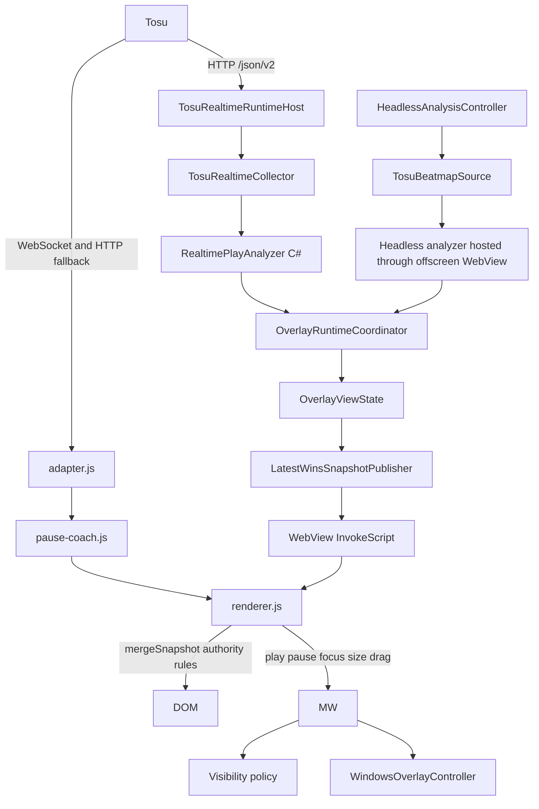
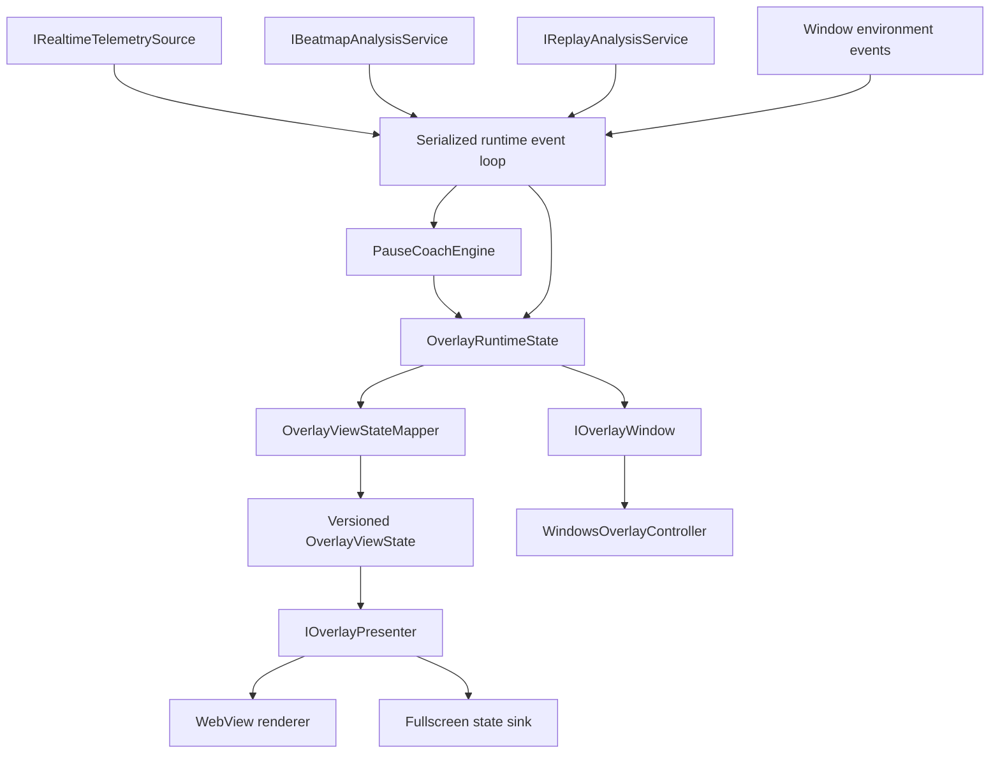

# Architecture and migration roadmap

Status: architecture direction approved; merged runtime remains transitional.

Re-audited against `origin/main` at `1894845` on 2026-08-24. The serialized
Application runtime, native realtime path, composed view-state, fullscreen
transport and isolated headless WebView are present. `MainWindow`, browser
Tosu/Pause Coach compatibility, renderer arbitration and mirrored legacy state
still retain production responsibilities, so the migration is not complete.

The detailed, current execution backlog is
[ARCHITECTURE_COMPLETION_PLAN.md](ARCHITECTURE_COMPLETION_PLAN.md). Its work
packages supersede the implementation-status wording in the historical PR A-J
sequence below. That sequence remains useful as design history, but must not be
used to infer which responsibilities are already authoritative.

Approved direction: 2026-08-23. Current-state audit: 2026-08-24.

Quality baseline for this working tree: the Release solution build completes
with 94 existing analyzer/compiler warnings and zero errors on the configured
Windows .NET 8 toolchain. The architecture slices in this branch do not add a
new warning class; warning cleanup remains a separate bounded task.

This document records the architecture review prompted by PR #8,
`feature/realtime-pause-coach`. It is a migration contract, not approval for a
big-bang rewrite. Each implementation PR starts only after explicit approval
and must preserve user-visible behaviour.

## Objective

The goal is to reduce coupling, make state ownership explicit, and make the
important application lifecycle deterministic and testable without a real
WebView, Windows HWND, Tosu process, or osu! instance.

The governing rule is:

> A fact must have exactly one owner.

In particular:

- gameplay state has one application owner;
- beatmap identity has one application owner;
- Pause Coach has one canonical attempt/session;
- realtime metrics have one domain owner;
- overlay visibility is derived from runtime state;
- the rendered DOM owns no business state.

The migration is successful when changing overlay visibility cannot change
Pause Coach analysis, changing WebView lifecycle cannot reset an attempt, Tosu
payload changes are caught by adapter contract tests, and DOM/CSS changes
cannot alter application state.

## Current architecture

PR #8 exposed three overlapping runtime paths:



The native desktop overlay now uses C# as the Pause Coach authority and
declares that authority before the browser adapter starts. JavaScript still
contains a compatibility implementation for preview/fullscreen documents that
have not received native view-state; the renderer keeps reconciliation only for
that transitional path and preserves partial headless/replay blocks.

This is the primary architectural blocker. Renderer reconciliation can reduce
visible symptoms, but it cannot make two independent state machines share one
canonical attempt.

## Problems by priority

### Blocker

1. Preview/fullscreen still carry a temporary JavaScript Pause Coach fallback.
2. `renderer.js` still owns business reconciliation for that compatibility path.
3. `MainWindow` still owns application state mirroring, presentation lifecycle,
   native window behaviour, analysis, and user-interface concerns together;
   Tosu realtime polling is now isolated in `TosuRealtimeRuntimeHost`.
4. A production-shaped test now exercises the core workflow from raw Tosu
   payloads through normalization, the coordinator and latest-wins delivery;
   stable/lazer fixture breadth and real surface acceptance remain open.

### High

1. Tosu state and payloads are still normalized in C# and the compatibility
   browser adapter; the duplicate `TosuService` state-only polling path has
   been removed, but producer cutover is not complete on every surface.
2. Beatmap identity is duplicated across Tosu, realtime, headless, snapshots,
   and renderer globals.
3. Application has separate headless and realtime slots, but exact replay and
   compatibility snapshot composition have not completed the same cutover.
4. The headless analyzer has a dedicated offscreen WebView, but its host
   lifecycle and late completion still require explicit Application causal
   identity.
5. Fullscreen has a native static-file state transport, but browser-side
   analysis remains a fallback until delivery and manual acceptance are proven.

### Medium

1. `ReplayAnalysis` contains deterministic replay, realtime Pause Coach domain
   behavior, and Tosu JSON normalization that belong to separate boundaries.
2. `Core` contains domain contracts, orchestration contracts, and presentation
   snapshot contracts.
3. `MainWindow` creates and coordinates infrastructure services instead of
   receiving focused controllers from a composition root.
4. Concurrency is coordinated through unrelated locks, semaphores, interlocked
   flags, dispatcher callbacks, and generation counters.
5. Logs are primarily free text rather than structured runtime transitions.

## State ownership

| Fact | Current owners | Target owner | Migration gate |
| --- | --- | --- | --- |
| Gameplay state | C# normalizer, coordinator, MainWindow compatibility flags, browser adapter | `OverlayRuntimeCoordinator` | Remove compatibility flags after parity sequences pass |
| Tosu connection | `TosuService` plus typed coordinator event | typed `TosuConnectionState` + transport generation | Move reconnect/backoff policy behind the host |
| Native realtime collection | `TosuRealtimeRuntimeHost` and polling controller; `TosuRealtimePayloadResult` at HTTP boundary | Application-owned realtime port | Start from application lifecycle and keep transport/reconnect outcomes typed |
| Tosu normalization | `TosuRealtimeCollector` for native path; browser adapter fallback | one shared normalization boundary | Prove HTTP/WebSocket fixture parity before deleting fallback |
| Beatmap identity | Tosu source, collector, browser adapter, snapshots, renderer | application beatmap state | Reject carousel/intermediate and identity-free stale updates |
| Attempt/session ID | C# desktop analyzer; JavaScript preview/fullscreen fallback | C# Pause Coach domain engine | Native view-state delivery on every surface |
| Realtime metrics | C# desktop analyzer; JavaScript preview/fullscreen fallback | C# Pause Coach domain engine | Cross-runtime fixtures and manual surface acceptance |
| Headless result | controller, window cache, renderer | versioned `DifficultyAnalysisState` | Causal request identity and complete Application composition |
| Replay result | replay session and renderer | versioned `ReplayAnalysisState` | Keep exact replay independent from realtime slots |
| Desired visibility | coordinator derivation plus MainWindow compatibility mirror | pure application derivation | Remove legacy visibility mirror after parity |
| Browser readiness | MainWindow, delivery controller and publisher | `PresentationSurfaceState` | Give preview/fullscreen explicit generations |
| Latest rendered state | native publisher and JavaScript globals | application presenter/coalescer | Remove browser snapshot arbitration after native cutover |
| DOM | renderer globals and elements | no business ownership | Renderer contract tests and preset recreation coverage |
| Version | root `VERSION`, imported project metadata | root `VERSION` | Remove historical packaging literals |

## Target architecture

The target is a modular monolith with inward dependency direction:



```text
Avalonia / Infrastructure
        -> Application
        -> Core + RealtimeAnalysis + ReplayAnalysis
```

The WebView, Tosu JSON, filesystem, Dispatcher, and Windows APIs must not cross
into Application or Domain.

## Domain boundary

`RealtimeTelemetrySample` and `RealtimePlayAnalyzer` are the foundation for the
authoritative C# Pause Coach implementation. The domain owns:

- attempt lifecycle and canonical attempt ID;
- map change and retry detection;
- pause, resume, result, and failure transitions;
- gameplay-time rolling windows;
- judgement deltas and accuracy calculations;
- timing statistics and insight generation;
- bounded history;
- replay/spectating unavailability.

Raw Tosu JSON must be translated before entering this boundary. JavaScript
must not reproduce these rules.

## Application runtime state

The proposed immutable state contains:

```text
OverlayRuntimeState
    RuntimeVersion
    ConnectionState
    BeatmapState + BeatmapGeneration
    GameplayState
    RealtimeAttemptState
    DifficultyAnalysisState
    ReplayAnalysisState
    OverlayModeState
    WindowEnvironmentState
    PresentationSurfaceState
    OverlayPresentationSettings
```

Visibility is derived from gameplay, preset policy, overlay mode, and the osu!
window environment. It is not synchronized through multiple mutable booleans.

Headless, replay, and realtime data occupy independent state slots. The
application composes them into one presentation contract; they never replace
one another directly.

## Events and concurrency

Runtime state changes should be serialized through one explicit event loop,
preferably `Channel<OverlayRuntimeEvent>` with one consumer.

Initial event set:

- `TelemetryReceived`;
- `TelemetryDisconnected`;
- `BeatmapAnalysisCompleted`;
- `ReplayAnalysisCompleted`;
- `OverlayModeEntered` / `OverlayModeExited`;
- `PresentationCreated` / `PresentationReady` /
  `PresentationDestroyed`;
- `OsuProcessChanged`;
- `OsuWindowMinimizedChanged`;
- `PresetChanged`;
- `ScaleChanged` for semantic persisted scale only, not raw pointer/resize
  pixels;
- `ApplicationStopping`.

Rules:

- only the event-loop consumer mutates runtime state;
- UI, Tosu, WebView, and Windows callbacks enqueue events only;
- slow I/O effects never block the event loop;
- analysis completions include the beatmap generation observed at delivery;
  explicit headless request/replay completion identity remains transitional;
- stale completions are rejected deterministically;
- gameplay telemetry is not blindly dropped or coalesced;
- presentation output uses latest-wins coalescing;
- cancellation is owned by the coordinator and its child lifecycles.

`RuntimeVersion` increases for accepted transitions. `ViewStateVersion`
increases only when the presentation contract changes.

## Versioning

The product version has one source of truth in the root `VERSION` file.
`Directory.Build.props` imports it into .NET assembly/package metadata; the
updater, build/package scripts and CI read the same file for user-agent and
artifact naming. Historical release notes may mention older releases, but no
build or runtime decision derives its version from those documents.

Updater install state is stored through an injected `UpdateStateStore`. Saves
are written to a temporary file and replaced only after serialization and flush
complete, so a cancelled or interrupted write does not publish a partial JSON
document. The store is deliberately separate from release lookup and install
policy.

## Presentation contract

JavaScript should receive an explicit `OverlayViewState` containing only data
needed for rendering:

```text
OverlayViewState
    ViewStateVersion
    BeatmapViewState
    DifficultyViewState
    ReplayViewState
    PauseCoachViewState
    PresentationMetadata
```

Renderer responsibilities are limited to rendering these blocks, honoring the
version, and reporting presentation measurements or input gestures. It does
not parse Tosu, create sessions, calculate insights, or merge producers.

WebView recreation changes only the presentation generation. The delivery
controller owns desktop/fullscreen logical generation counters, while the
desktop generation is reported back to the Application runtime. Runtime state
and the active Pause Coach attempt survive, and the latest view state is
replayed when the new document becomes ready. Preview/cross-surface identity
still needs to be unified before the migration is complete.

## Headless and replay relationship

On a beatmap transition:

1. `BeatmapGeneration` increases.
2. The Pause Coach domain receives the normalized transition.
3. Headless analysis starts with the new beatmap key and generation.
4. A completion is accepted only if both still match current state.
5. The view-state mapper composes only current-generation results.

Replay analysis follows the same versioned completion rule. The renderer never
decides whether an analysis result is stale.

## Application ports

Only boundaries that isolate real volatility should become interfaces:

- `IRealtimeTelemetrySource`;
- `IBeatmapAnalysisService`;
- `IReplayAnalysisService`;
- `IOverlayPresenter`;
- `IOverlayWindow`;
- `IClock` when wall-clock behaviour must be controlled in tests;
- structured runtime diagnostics.

No interface-per-class, mediator framework, event sourcing, CQRS framework, or
general-purpose dependency injection container is planned.

## Solution structure

The merged solution already contains Application. One additional domain
boundary is justified to prevent exact replay from becoming the home of
realtime analysis:

```text
src/Core
src/Application
src/RealtimeAnalysis
src/ReplayAnalysis
src/Avalonia
src/Updater
```

- `Core`: shared domain and analyzer contracts.
- `Application`: runtime state, events, coordinator, ports, versioning, and
  view-state composition.
- `RealtimeAnalysis`: normalized realtime contracts, attempt lifecycle and
  Pause Coach business logic; no Tosu JSON or presentation APIs.
- `ReplayAnalysis`: deterministic exact replay parsing, judging and analytics;
  no realtime attempt lifecycle or Tosu JSON.
- `Avalonia`: composition root, ViewModels/Views, Tosu/WebView/filesystem
  implementations, and Windows adapters.
- `Updater`: self-update executable; launcher-side updater orchestration remains
  in Avalonia services but is decomposed along release/download/install/state
  boundaries.

A separate Infrastructure assembly is not required initially. Infrastructure
folders inside Avalonia are sufficient until another host needs to reuse them.
If the dependency audit proves that a `Core/Realtime` namespace is materially
simpler than a new project, that deviation must be recorded in an ADR before
implementation. The migration must not begin with unrelated project/folder
renames.

## Existing components to preserve

- `RealtimeTelemetrySample`;
- `RealtimePlayAnalyzer` and `PauseCoachInsightEngine`;
- `OverlayVisibilityPolicy`;
- `LatestWinsSnapshotPublisher` semantics and tests;
- `AnalysisRunScope`, execution generations, and typed headless keys;
- `IAnalyzerEngine`, `IAnalyzerScriptHost`, `ITosuBeatmapSource`, and
  `IAnalysisSnapshotPresenter` boundaries;
- replay parsing, judging, rolling windows, and insight logic;
- `WindowsOverlayController` as a platform adapter;
- preset catalog, templates, and CSS assets.

## Code to remove after proven replacement

- Pause Coach business logic in `assets/overlay/runtime/pause-coach.js`;
- Pause Coach processing and session creation in `adapter.js`;
- browser-side Tosu polling/WebSocket as a Pause Coach source;
- `renderer.mergeSnapshot()` authority and reconciliation rules;
- `window.__overlayNativePauseCoachSnapshot`;
- browser-generated Pause Coach session IDs;
- MainWindow gameplay flags and polling/publisher plumbing;
- browser play/pause messages that mutate application gameplay state;
- duplicate `TosuService.GetGameplayStateAsync` normalization (removed in the
  current architecture slice; `TosuService` now exposes one full-payload
  realtime transport to `TosuRealtimeRuntimeHost`);
- direct headless publication into WebView outside application composition.

Removal happens only after the replacement path has characterization and
application scenario coverage.

## Testing strategy

### Domain tests

Fast tests cover attempt lifecycle, retry, pause/resume/results, rolling
windows, bounded history, timing, judgement deltas, accuracy, insights, and
replay/spectating behaviour.

### Application scenario tests

This is the primary regression suite. It uses fake telemetry, headless/replay
services, window, presenter, and clock. It must cover:

1. menu -> play 30 seconds -> pause;
2. play -> pause -> resume -> play -> pause;
3. retry on the same beatmap;
4. map A -> map B with stale analysis completion;
5. WebView recreation during an attempt;
6. hidden presentation while telemetry continues;
7. temporarily unavailable presentation;
8. replay and spectating;
9. partial Tosu payloads and explicit reset;
10. results with retained final diagnosis.

### Infrastructure contract tests

Recorded raw fixtures:

- `stable-playing.json`;
- `stable-paused.json`;
- `stable-results.json`;
- `lazer-playing.json`;
- `lazer-paused.json`;
- `partial-payload.json`;
- `retry-reset.json`;
- `replay.json`;
- `spectating.json`.

HTTP and WebSocket inputs must normalize to equivalent domain samples.

### Presentation tests

Tests validate `OverlayViewState -> DOM` without Tosu or Pause Coach business
logic in JavaScript. They cover block rendering, version ordering, preset DOM
replacement, scaling, and size reporting.

### E2E and manual acceptance

Keep a small set of critical stable/lazer, WebView recreation, fullscreen,
DPI, and Win32 visibility checks. Manual runtime acceptance remains required.

## Architecture rules

CI should enforce:

- Core does not reference Avalonia, WebView, Windows, or Infrastructure;
- ReplayAnalysis does not reference Avalonia;
- Application does not reference Avalonia or `MainWindow`;
- after the Tosu migration, ReplayAnalysis does not parse Tosu JSON;
- MainWindow does not reference realtime collector/analyzer implementations;
- renderer assets do not contain Tosu routes, session lifecycle, retry logic,
  or metrics calculations;
- only Infrastructure implements raw Tosu and presentation ports.

Assembly dependency rules may use `NetArchTest.Rules`. JavaScript restrictions
can be enforced with a small repository convention test.

## Observability

Important transitions should emit structured data containing:

```text
eventType
runtimeVersion
viewStateVersion
beatmapId / beatmapGeneration
attemptId
mapTimeMs
gameplayState
presentationGeneration
```

Log transitions, session changes, rejected stale completions, and throttled
boundary failures. Do not log every telemetry packet indefinitely.

## Incremental migration

### PR A — architecture contract and characterization tests

- Objective: freeze intended behaviour before changing production wiring.
- Files: `docs/ARCHITECTURE.md`, ADRs, architecture tests, test-only current
  pipeline scenario harness.
- New abstractions: test-only harness; no production framework.
- Preserve: all user-visible behaviour.
- Tests: play/pause, resume, retry, results, partial payload, hidden/visible,
  publisher failure/recreation, initial dependency rules.
- Removed code: none.
- Risk: low.
- Rollback: remove docs/tests.
- Dependency: none.

### PR B — single Tosu normalization boundary

- Objective: one native raw-Tosu adapter and one normalized sample contract.
- Files: `Avalonia/Infrastructure/Tosu`, `TosuService`, current collector and
  fixtures.
- New abstractions: `IRealtimeTelemetrySource`,
  `TosuRealtimeTelemetrySource`.
- Preserve: polling interval, stable/lazer behaviour, preview and overlay
  updates.
- Tests: all recorded Tosu fixtures and HTTP/WebSocket equivalence.
- Removed code: duplicate native gameplay-state normalization.
- Risk: medium.
- Rollback: temporary unified-source feature switch.
- Dependency: PR A.

### PR C — Application state and events

- Objective: introduce the application assembly, immutable state, events,
  versions, and pure visibility derivation without changing production UI.
- Files: new `src/Application` and tests.
- New abstractions: runtime state, event model, ports, view-state contract.
- Preserve: production path remains unchanged.
- Tests: all ten application scenarios using fake ports.
- Removed code: none.
- Risk: low to medium.
- Rollback: remove the isolated assembly.
- Dependency: PR A and normalized domain model from PR B.

### PR D — serialized coordinator in shadow mode

- Objective: run the coordinator against production telemetry without owning
  presentation or HWND behaviour yet.
- Files: Application coordinator and Avalonia composition root.
- New abstractions: event loop and structured comparison diagnostics.
- Preserve: legacy path remains authoritative.
- Tests: event ordering, cancellation, stale completion, lifecycle shutdown.
- Removed code: none.
- Risk: medium.
- Rollback: disable shadow registration.
- Dependency: PR B and PR C.

### PR E — native runtime and visibility cutover

- Objective: make coordinator authoritative for gameplay, Pause Coach, and
  desired native visibility.
- Files: coordinator, MainWindow wiring, window adapter, telemetry source.
- New abstractions: `IOverlayWindow` implementation.
- Preserve: visibility policy, minimized editing behaviour, hotkeys, native
  click-through, launcher preview.
- Tests: full scenario suite plus window-state effect tests.
- Removed code: MainWindow gameplay flags, polling guards, browser authority
  fallback, and direct native snapshot mapping.
- Risk: high.
- Rollback: one temporary legacy-native feature switch.
- Dependency: PR D parity evidence.

### PR F — versioned view-state composition

- Objective: compose independent beatmap, headless, replay, and realtime slots
  in Application.
- Files: Application mapper, headless/replay service adapters, presenters.
- New abstractions: `OverlayViewState`, versioned analysis completion.
- Preserve: all current presets and displayed fields.
- Tests: map A -> B stale results, replay races, partial analysis, unavailable
  presentation.
- Removed code: direct headless/replay publication outside Application.
- Risk: high.
- Rollback: temporary legacy snapshot presenter adapter.
- Dependency: PR E.

### PR G — dumb native renderer

- Objective: render one versioned view state without producer reconciliation.
- Files: `renderer.js`, WebView presenter, renderer tests.
- New abstractions: version-only stale-render guard.
- Preserve: DOM, preset CSS, scaling, and size reporting.
- Tests: `OverlayViewState -> DOM`, stale version, preset replacement.
- Removed code: native/browser/headless authority rules and `mergeSnapshot` for
  launcher/desktop overlay.
- Risk: medium.
- Rollback: restore previous renderer while Application still emits compatible
  state.
- Dependency: PR F.

### PR H — fullscreen state transport and JS analyzer removal

- Objective: deliver authoritative C# view state to the Tosu fullscreen page.
- Files: fullscreen service/sink and fullscreen runtime asset.
- New abstractions: versioned fullscreen view-state transport with freshness.
- Preserve: fullscreen preset and visibility behaviour.
- Tests: transport atomicity/freshness and fullscreen renderer fixture; manual
  stable/lazer fullscreen acceptance.
- Current increment: the application writes an atomic `view-state.json` into
  Tosu's static overlay directory and the fullscreen runtime polls it with a
  version guard. Browser Pause Coach remains a compatibility fallback until
  the transport has passed manual fullscreen acceptance.
- Planned removal: JavaScript Pause Coach engine, browser-generated sessions,
  and browser Tosu Pause Coach source.
- Risk: high and Windows-specific.
- Rollback: an explicit legacy fullscreen mode for one migration release; it
  must never compete with native state in the same surface.
- Dependency: PR G.

### PR I — headless host lifecycle isolation

- Objective: prevent presentation WebView navigation from owning analyzer
  runtime lifecycle.
- Current increment: headless analysis uses a separate 1×1 offscreen
  `NativeWebView`, with its own navigation and message lifecycle. The visible
  presentation WebView no longer receives headless engine scripts.
- Files: analyzer script-host composition and headless service adapter.
- New abstractions: dedicated implementation behind the existing script-host
  and analysis ports.
- Preserve: analyzer protocol and produced metrics.
- Tests: navigation/recreation while analysis is in flight, worker recovery,
  stale completion rejection.
- Removed code: direct dependency on the current presentation browser.
- Risk: medium.
- Rollback: keep the current WebView script-host implementation available.
- Dependency: PR F.

### PR J — MVVM/window cleanup and compatibility removal

- Objective: make MainWindow a thin view shell after runtime behaviour is
  already controlled elsewhere.
- Files: MainWindow, ViewModels, WebView/window/interaction/scale adapters.
- New abstractions: only adapters justified by tests and platform volatility.
- Preserve: launcher settings, update/localization workflow, drag/scale/DPI.
- Tests: ViewModel commands and platform adapter tests; manual UI acceptance.
- Removed code: proven compatibility paths and obsolete MainWindow logic.
- Risk: medium.
- Rollback: PR-level revert; no domain/state rollback required.
- Dependency: PR E through PR I.

## Required ADRs

The first migration PR should add concise ADRs for:

1. authoritative C# Pause Coach source of truth;
2. serialized runtime event processing;
3. WebView as presentation only;
4. canonical attempt/session identity;
5. single Tosu normalization boundary;
6. fullscreen view-state transport when its implementation is selected.

## First implementation gate

The first implementation PR is PR A. It must not change production behaviour.
No later migration PR starts until PR A is reviewed and approved.

Minimum PR A acceptance:

- current and target architecture are documented;
- five initial ADRs exist;
- a test-only current-pipeline scenario harness exists;
- deterministic tests cover play -> 30 seconds -> pause, resume -> pause,
  retry, results, partial payload, hidden collection, and presentation
  recreation;
- initial assembly dependency rules run in CI;
- the JavaScript/native authority conflict is recorded as an open migration
  blocker.
